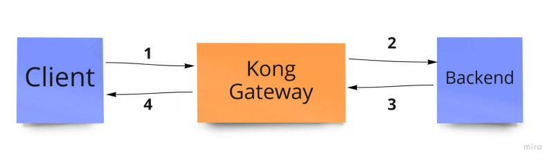
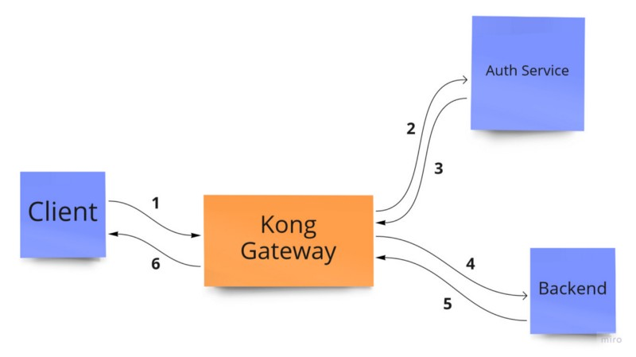
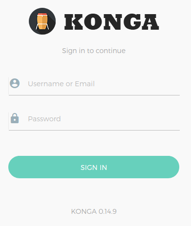
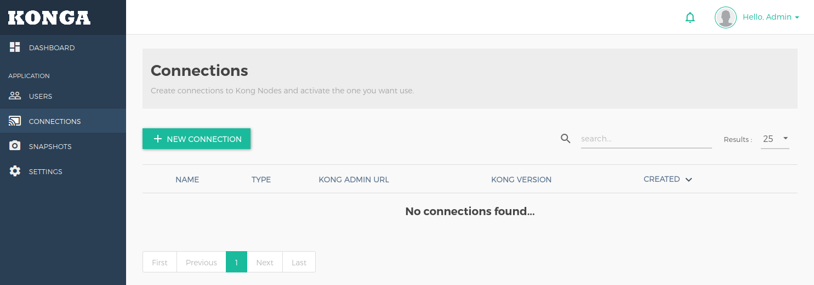
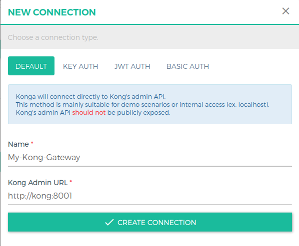
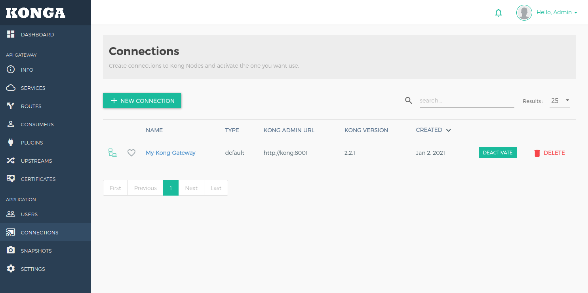
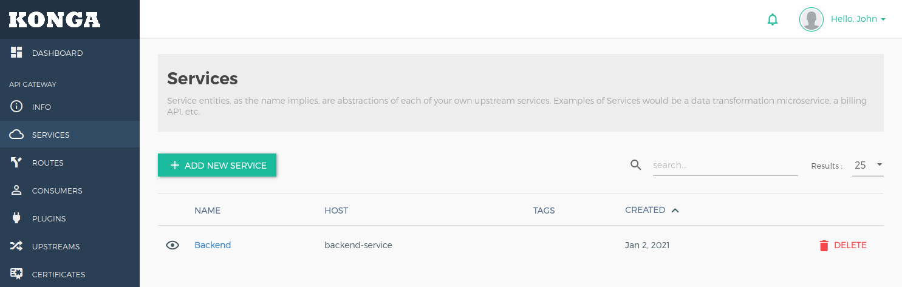
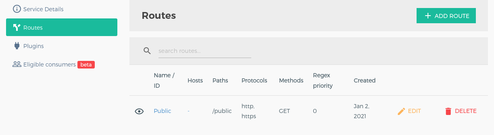

## Launch Kong Gateway with Konga (Kong GUI)

There is a time that Kong gateway does not satisfy your authentication and authorization strategy and you want to add your custom authentication and authorization service. So for this scenario you create your own authentication service and Kong gateway passes the requests to it. In this case we have two scenario to handle the requests.

1. First Scenario (Public Routes): In this scenario a client send the request to Kong gateway (#1) then Kong gateway send it to the destination for example Back-end service (#2) then Back-end service send the response back to the Kong gateway (#3). At last, Kong gateway send the Back-end response to the client (#4).

<p align="center">
  
</p>

2.  Second Scenario (Private Routes): In this scenario a client send the request to Kong gateway (#1) then Kong gateway send it to the Auth service (#2) then Auth service verified the authorization header and send the Auth response back to the Kong gateway (#3), at this moment Kong gateway make a decision if the response status is over 299 then send back the response to the client (#6) for example 401 Unauthorized or 403 Forbidden but if the response is between 200 and 299 then send the user information along with the given body (#1) forward to Back-end service (#4) then Back-end service send the response back to Kong gateway (#5). At last, Kong gateway send the Back-end response to the client (#6).

<p align="center">
  
</p>

## Introduction

I assume that you already know how Kong Gateway and its plugins works. For more information about Kong custom plugins you can see this [page](https://docs.konghq.com/2.2.x/plugin-development/).You can see the source code by this [Link](http://google.com).
First of all we should bring up kong gateway along with the Konga GUI. So we should create a Yaml file with the name docker-compose. I customized this [repository](https://github.com/jorgecarcamob/kong-konga-postgres/blob/master/docker-compose.yml) to create Kong Gateway. Now run docker-compose.yaml file by the following command.

```shell
$ ls
docker-compose.yaml
$ docker-compose up
...
```

You can check Kong Gateway container by opening this link [http://localhost:8001](http://localhost:8001) and if it is not running use the following command to restart Kong container.

```shell
# kong is container name for kong service
$ docker restart kong
...
```

Check Konga GUI by opening this link [http://localhost:1337](http://localhost:1337) and if it is not running use the following command to restart Konga container.

```shell
# konga is container name for konga service
$ docker restart konga
...
```

<p align="center">
  
</p>

To login to the Konga GUI, use a konga-user.js file to add your custom users. Opening login page [http://localhost:1337/#/login](http://localhost:1337/#/login) and submit a username and password in konga-user.js file.

> **Credential**
> username: admin, password: adminadminadmin

Now add a connection for Konga GUI which can be connected to Kong Gateway.

<p align="center">
  
</p>

So go to the Connection section and add a connection to be connected to Kong Gateway. Choose a custom name for your connection and add a link to the Kong Gateway. Link location in this example should be `http://kong:8001`.

<p align="center">
  
</p>

After that you should see the Service, Route, Plugin, and ... sections.

<p align="center">
  
</p>

## First Scenario: Public Route

In this scenario, first add a backend service using konga GUI then add the route to backend public service. So go to [http://localhost:1337/#/services](http://localhost:1337/#/services) and add a service with the following parameters.

```
Name: Backend
Protocol: http
Host: backend-service
Port: 3000
Path: /
```

<p align="center">
  
</p>

Then click on the newly created service and go to the Route section and add a route to the public backend route (/public).

```
Name: Public
Paths: /public (press Enter)
Methods: GET (press Enter)
Strip Path: false
```

<p align="center">
  
</p>

Now if you open [http://localhost:8000/public](http://localhost:8000/public) link you should see the following result from Backend Service.

```json
{
  "products": [
    {
      "name": "Product 1",
      "price": "1 $",
      "createdBy": "Admin",
      "createAt": "2021-01-02T13:41:46.683Z"
    }
  ],
  "count": 1,
  "message": "[Backend Service] This is Public route!"
}
```
